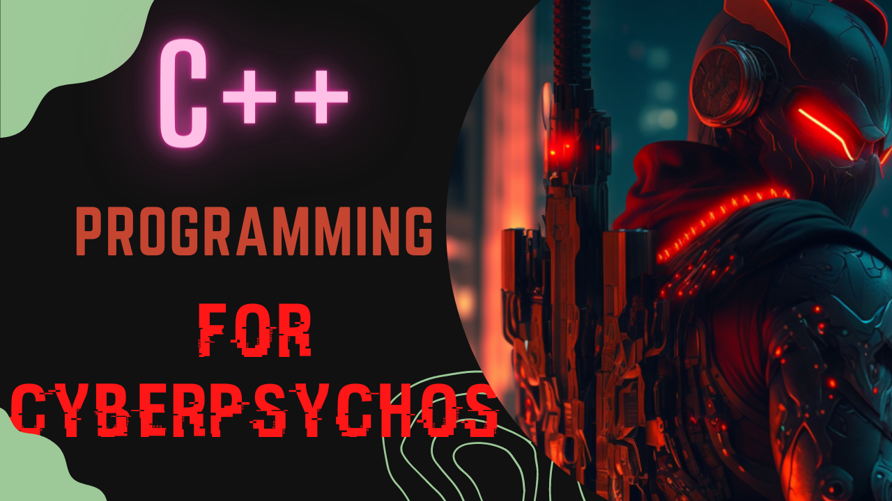

# C++ Programming For Cyberpsychos

_**A Beginner Friendly C++ Course**_ 💀

 
 

## 🌠 Chapters
 

1.  Class
2.  Struct
3.  Enum
4.  Access Modifiers
5.  Header VS. Source Files
6.  Overview of the Standard Template Library (STL)
7.  Input & Output
8.  Data Types
9.  Arrays
10. Conditional Statements
11. For loops
12. While/doWhile Loops
13. Overview of Pointers
14. What is "int main()"?

💫 + i added a Hotel Reservation System Project
 
💫 - go ahead check it out :3
